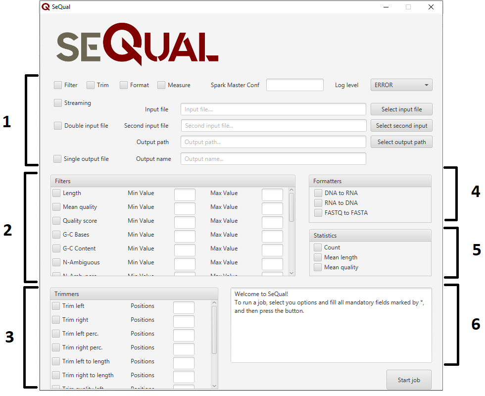

# SeQual-Stream
**SeQual-Stream** is a Big Data tool to perform quality control operations (e.g. filtering, trimming) on genomic datasets in a scalable way, currently supporting single-end and paired-end reads in FASTQ/FASTA formats.

It is a tool derived from **SeQual**, which can be found on its own [repository](https://github.com/UDC-GAC/SeQual/).
SeQual-Stream adapts its operation to work in streaming mode and process the data as it is downloaded to HDFS or another file system.
It allows switching between batch mode (former SeQual) and streaming mode (new SeQual-Stream).

In the same way as SeQual, this tool is specifically oriented to work with large amounts of data taking advantage of distributed-memory systems such as clusters and clouds looking forward to offer the best performance. SeQual-Stream is implemented in Java on top of the open-source [Apache Spark](http://spark.apache.org) framework to manage such distributed data processing over a cluster of machines and introduces the streaming mode using the module [Spark Structured Streaming](https://spark.apache.org/docs/latest/structured-streaming-programming-guide.html).

## Getting Started

SeQual-Stream can be used both on Windows and UNIX based systems. Nevertheless, to be able to compile and use SeQual-Stream, you need a valid installation of the following:

* **Java Development Kit (JDK)** version 1.11 or above. 
* **Apache Maven** version 3.0 or above. 
* **Apache Spark** version 3.0 or above. 

You can clone the SeQual-Stream repository with the following command:

```
git clone https://github.com/oscar-castellanos/SeQual-Stream
```

Due to SeQual (batch mode) depending on HSP 1.0, you will need to manually add the included jar in your Maven local repository.
You can use the following command from within the SeQual-Stream root directory:

```
mvn org.apache.maven.plugins:maven-install-plugin:2.5.2:install-file -Dfile=SeQual-Model/dependency-jars/hadoop-sequence-parser-1.0.jar -DgroupId=es.udc.gac -DartifactId=hadoop-sequence-parser -Dversion=1.0
```

Now, to compile SeQual-Stream, you just need to execute the following Maven command from within the SeQual-Stream root directory:

```
mvn package -DskipTests
```

This will generate a folder called /target inside the three modules of the project (SeQual-Model, SeQual-CMD and SeQual-GUI), containing each one the appropiated jar file. How to use each module is explained below.

Note that the first time you execute the previous command, Maven will download all the plugins and related dependencies it needs to fulfill the command. From a clean installation of Maven, this can take quite a while. If you execute the command again, Maven will now have what it needs, so it will be able to execute the command much more quickly.

### SeQual-CMD

SeQual-CMD allows the processing of NGS datasets from a console interface. To do so, you just need to use the *spark-submit* command provided by Spark to launch the appropriate jar file (sequal-cmd.jar) located at the *SeQual-CMD/target* directory.

```
spark-submit [SPARK_ARGS] SeQual-CMD/target/sequal-cmd.jar [SEQUAL-STREAM_ARGS]
```

To specify the specific operations to be performed over the input datasets, together with their necessary parameters, a Java properties file is used as input argument (option -c). SeQual-Stream includes a blank properties file at the *etc* directory (ExecutionParameters.properties) that can be used as template, which includes all the possible operations and parameters. Additionally, SeQual-CMD provides the option -g to generate a new blank properties file as shown in the examples below.

All the available input arguments to SeQual-CMD are the following:

* **-i InputFile:** Specifies the input file from where sequences will be read.
* **-di InputFile:** Specifies the second input file from where paired sequences will be read, in case of processing paired-end datasets.
* **-o OuputDirectory:** Specifies the output directory where the resulting sequences will be written to.
* **-c ConfigFile:** Specifies the path to the properties file.
* **-smc SparkMasterConf:** Specifies the Spark master configuration (local[*] by default).
* **-lc LoggerConfLevel:** Specifies the logger configuration for Spark and other libraries (ERROR by default).
* **-g:** Generates a blank properties file within the path specified with -o.
* **-f:** Filters sequences following the specified parameters.
* **-fo:** Formats sequences following the specified parameters.
* **-t:** Trims sequences following the specified parameters.
* **-s:** Computes the statistics before and after performing other operations on the sequences.
* **-sfo:** Generates a single output file named {input-file-name}-results.{format} within the output directory, along with a folder named Parts containing the output files for each partition.

#### Examples

The following command processes a single-end FASTQ dataset using the TRIMRIGHT operation in order to trim sequences 15 positions (i.e. bases) starting from the right:

```
spark-submit SeQual-CMD/target/sequal-cmd.jar -i dataset.fastq -o output -c etc/ExecutionParameters.properties -t
```

The properties file used in the previous example contains the following values:

```
Trimmers=TRIMRIGHT
TrimRight=15
```
In streaming mode, if in the previous example the input dataset was stored on the local file system (e.g. in the $HOME/datasets path) rather than HDFS, you could use the following command:

```
spark-submit SeQual-CMD/target/sequal-cmd.jar -i file://$HOME/datasets/dataset.fastq -o output -c etc/ExecutionParameters.properties -t
```

The following example shows the processing of a paired-end dataset (i.e. two input files) using the QUALITY operation in order to filter out those paired sequences whose mean quality is below 25

```
spark-submit SeQual-CMD/target/sequal-cmd.jar -i dataset_1.fastq -di dataset_2.fastq -o output -c etc/ExecutionParameters.properties -f
```
In the previous example, the properties file contains:

```
SingleFilters=QUALITY
QualityMinVal=25
```

The last example shows how to create a new blank properties file (ExecutionParameters.properties) using the option -g. The template is generated within the directory specified using the option -o:

```
spark-submit SeQual-CMD/target/sequal-cmd.jar -g -o ouput
```

### SeQual-GUI

SeQual-GUI allows using a graphical user interface rather than the console, thus greatly simplifying its usage to non-computer science experts. This GUI has been implemented upon the [JavaFX](https://openjfx.io) library.

To execute SeQual-GUI, you must also rely on the spark-submit command to do so. Unlike SeQual-CMD, no additional arguments are needed, so just launch the appropriate jar file (sequal-gui.jar) which is located at the *SeQual-GUI/target* directory:

```
spark-submit [SPARK_ARGS] SeQual-GUI/target/sequal-gui.jar
```

#### Important notes about JavaFX

In order to use SeQual-GUI, you need a JRE 1.8 flavour **with bundled JavaFX** support. For simplicity, it is **recommended to use Oracle JRE 1.8** which already includes the required JavaFX libraries. Otherwise, you must ensure that such libraries are available on your system or that you use a JRE 1.8 flavour with them (i.e. BellSoft, Azu Zulu). Note that most JRE 1.8 versions from OpenJDK do not provide JavaFX libraries, which are available to be installed separately on some systems. On UNIX-based systems, you can use the [SDKMAN manager](https://sdkman.io) to install a JRE 1.8 flavour with JavaFX, which are those listed with the FX suffix when executing sdk list java.

#### GUI

The graphical interface of SeQual-Stream is shown in the following picture.



This interface is mainly composed by 6 different fields:

* **1: Configuration section.** Allows the user to specify different parameters, like the input file, the output folder, the log level, using or not streaming mode ...
* **2: Filters section.** Allows the user to select which filters should be applied, as well as their corresponding parameters.
* **3: Trimmers section.** Allows the user to select which trimmers should be applied, as well as their corresponding parameters.
* **4: Formmatters section.** Allows the user to select which formatters should be applied.
* **5: Statistics section.** Allows the user to select which statistics should be computed.
* **6: Output section.** A console-like window that shows useful information to the user about the status of the data processing.

## SeQual-Stream features
SeQual-Stream allows switching between batch (SeQual) or streaming (SeQual-Stream) mode using the parameter **Mode** on its properties file. 

On batch mode four groups of features or operations that can be performed over the input datasets are offered, grouped based on the operation's objective.
On streaming mode, a subset of this operations are supported.
These groups of are:

* **Filters**: They remove the sequences that do not comply with the specified thresholds specified by the user. There are single filters as well as group filters (only in batch mode).
* **Trimmers**: They trim the sequences following the specified parameters.
* **Formatters**: They apply data transformations to the sequences.
* **Statistics** (only in batch mode): They compute different statistics in the dataset.
    
Besides the previous mentioned groups, there are other features grouped under the name **Transversals**, which allow the user to configure the application more thoroughly, specifying aspects like the log level or the Spark configuration.

### Single Filters

* **LENGTH**: Filters sequences based on an indicated maximum and/or minimum length threshold.
* **QUALITYSCORE**: Filters sequences based on an indicated maximum and/or minimum quality score per base threshold, removing them if any of its bases is outside the threshold. Quality score from each base is calculated following Illumina encoding.
* **QUALITY**: Filters sequences based on an indicated maximum and/or minimum mean quality threshold. Quality score from each base is calculated following Illumina encoding.
* **GCBASES**: Filters sequences based on an indicated maximum and/or minimum quantity of G(uanine) and C(ytosine) bases threshold.
* **GCCONTENT**: Filters sequences based on an indicated maximum and/or minimum GC-content threshold.
* **NAMB**: Filters sequences based on an indicated maximum and/or minimum N-ambiguous bases quantity threshold.
* **NAMBP**: Filters sequences based on an indicated maximum and/or minimum N-ambiguous bases percentage threshold.
* **NONIUPAC**: Filters sequences if they contain Non-IUPAC bases (that is, any base other than A, T, G, C or N).
* **PATTERN**: Filters sequences according to the absence of a specified pattern (that is, if it does not contain the pattern, the sequence is removed) along with its repetitions (for example, the pattern ATC with two repeats would be ATCATC).
* **NOPATTERN**: Filters sequences according to the existence of a specified pattern (that is, if it does not contain the pattern, the sequence is removed) along with its repetitions (for example, the pattern ATC with two repeats would be ATCATC).
* **BASEN**: Filters sequences according to whether they contain a maximum and/or minimum number of one or several base types (or even base groups).
* **BASEP**: Filters sequences according to whether they contain a maximum and/or minimum number of one or several base types (or even base groups).

### Group Filters (only in batch mode)

* **DISTINCT**: Filters duplicated sequences maintaining the ones with the highest quality (if they have associated quality).
* **ALMOSTDISTINCT**: Filters duplicated sequences maintaining the ones with the highest quality (if they have associated quality), allowing an indicated margin of differences (for example, two sequences with 2 differents bases can be considered equals if the specified limit allows it).
* **REVERSEDISTINCT**: Filters reverse sequences maintaining the ones with the highest quality (if they have associated quality). For example, the reverse sequence of ATG is GTA.
* **COMPLEMENTDISTINCT**: Filters complementary sequences maintaining the ones with the highest quality (if they have associated quality). For example, the complementary sequence of ATG is TAC.
* **REVERSECOMPLEMENTDISTINCT**: Filters reverse complementary sequences maintaining the ones with the highest quality (if they have associated quality). For example, the reverse sequence of ATG is CAT.

### Trimmers

* **TRIMLEFT**: Trims sequences according to an indicated number of positions starting from the 5'-end (left).
* **TRIMRIGHT**: Trims sequences according to an indicated number of positions starting from the 3'-end (right).
* **TRIMLEFTP**: Trims sequences according to an indicated percentage of the total number of bases starting from the 5'-end (left). 
* **TRIMRIGHTP**: Trims sequences according to an indicated percentage of the total number of bases starting from the 3'-end (right).
* **TRIMQUALLEFT**: Trims sequences until achieving an indicated mean sequence quality starting from the 5'-end (left).
* **TRIMQUALRIGHT**: Trims sequences until achieving an indicated mean sequence quality starting from the 3'-end (right).
* **TRIMNLEFT**: Trims N-terminal tails with a specified minimum length at the 5'-end (left). A N-terminal tail is a set of N bases found at the beginning or end of a sequence. For example, the three Ns of the sequence NNATCGAT form a N-terminal tail at the beginning.
* **TRIMNRIGHT**: Trims N-terminal tails with a specified minimum length at the 3'-end (right).
* **TRIMLEFTTOLENGTH**: Trims sequences to a specified maximum length starting from the 5'-end (left).
* **TRIMRIGHTTOLENGTH**: Trims sequences to a specified maximum length starting from the 3'-end (right).

### Formatters

* **DNATORNA**: Transforms DNA sequences to RNA sequences.
* **RNATODNA**: Transforms RNA sequences to DNA sequences.
* **FASTQTOFASTA**: Transforms sequences in FASTQ format to FASTA format. In this case base the information of the quality is lost.

### Statistics (only in batch mode)

* **COUNT**: Calculates the total number of sequences in the dataset before and after performing the indicated operations on them.
* **MEANLENGTH**: Calculates the mean length of the sequences in the dataset before and after performing the indicated operations on them.
* **MEANQUALITY**: Calculates the mean quality of the sequences in the dataset before and after performing the indicated operations on them.

### Transversals

* **Reading of FASTA format datasets:** Allows to read datasets of sequences in FASTA format. In streaming mode, datasets can be stored in another file system besides HDFS and can be in the process of being downloaded.
* **Reading of FASTQ format datasets:** Allows to read datasets of sequences in FASTA format. In streaming mode, datasets can be stored in another file system besides HDFS and can be in the process of being downloaded.
* **Reading of paired-end FASTA format datasets:** Allows to read datasets of paired-end sequences in FASTA format. The sequences must be separated in two different input files. In streaming mode, datasets can be stored in another file system besides HDFS and can be in the process of being downloaded.
* **Reading of paired-end FASTQ format datasets:** Allows to read datasets of paired-end sequences in FASTA format. The sequences must be separated in two different input files. In streaming mode, datasets can be stored in another file system besides HDFS and can be in the process of being downloaded.
* **Writing of resulting sequences:** Allows to write the resulting sequences after the operations in the indicated path, generating two different folders in case of paired-end datasets. This type of writing is done by default, writing the result in several output text files. In streaming mode, the output text files are written into several subfolders.
* **Writing of resulting sequences to an individual file:** Allows to write the resulting sequences after the operations to a single output file in the indicated path, or in to two output files in case of paired-end datasets.
* **Configure Spark execution mode:** Allows to configure the master URL for Spark, being local[*] by default (which implies using all the available cores in the machine where SeQual-Stream is executed).
* **Configure the level of log shown to the user:** Allows to configure the log level shown to the user by Spark and other libraries. The default level is ERROR.
* **Generation and reading of a properties file:** Allows to generate a template file where the operations to be carried out can be specified, as well as the necessary parameters for them.
* **Select between Batch or Streaming mode:** Allows switching between batch mode (SeQual) or streaming mode (SeQual-Stream).

## Used tools
* [Java](https://www.java.com) - Programming Language
* [Apache Spark](https://spark.apache.org) - Big Data Framework
* [Apache Maven](https://maven.apache.org) - Dependency Management

## Authors

* **&Oacute;scar Castellanos Rodr&iacute;guez**
* **Roberto R. Exp&oacute;sito** (http://gac.udc.es/~rreye)
* **Juan Touriño Dom&iacute;nguez** (https://gac.udc.es/~juan/)

## License

SeQual-Stream is distributed as free software and is publicly available under the GNU AGPLv3 license (see the [LICENSE](LICENSE) file for more details).
